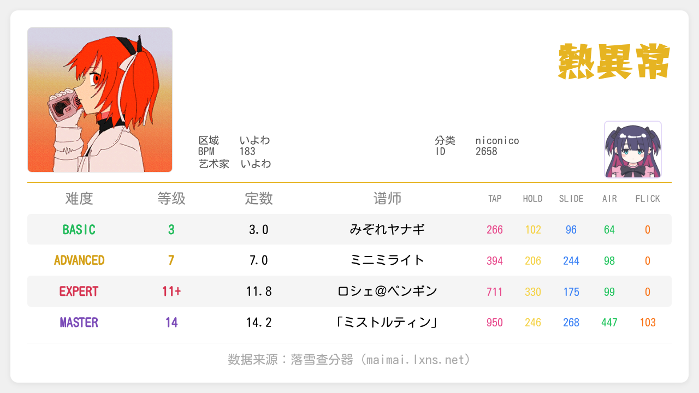
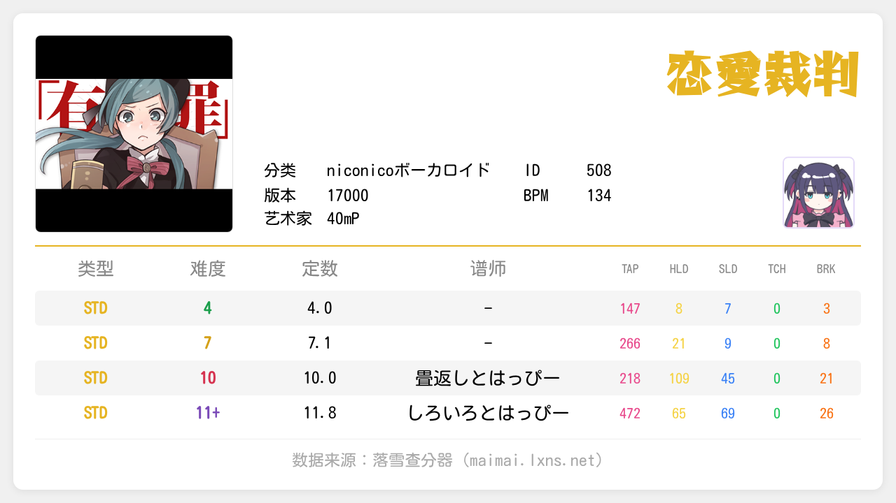
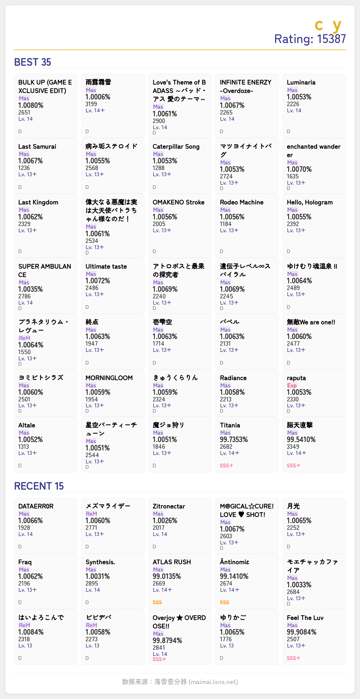
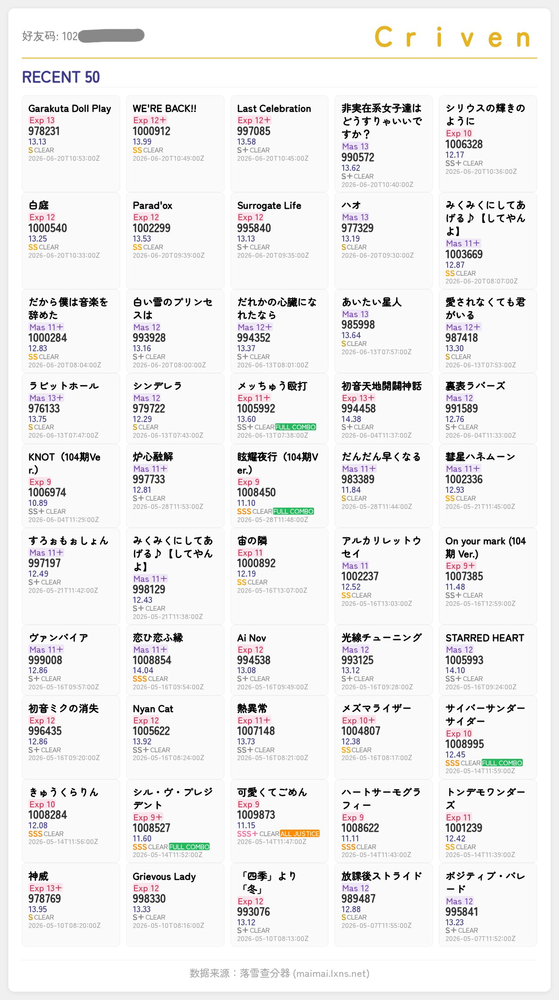

# 落雪DX

普通的国服舞萌DX查分插件，只是使用落雪接口。

[功能](#功能) · [安装 & 配置](#安装--配置) · [FAQ](#faq) · [鸣谢](#鸣谢)

---

|  |  |
| ------------------------------------------------- | ----------------------------------------------------- |
|  |      |

## 功能

- **OAuth / 开发者API** 授权模式
- **查询歌曲基本信息**（曲名、艺术家、难度等）
- **查询玩家成绩**（best50、等级/牌子进度、单曲成绩等）
- **查询定数表、分数列表**
- **LLM 工具**：注册 function tools，可通过自然语言对话查分（b50、单曲成绩、查歌等）

## 安装 & 配置

1. 在插件市场中安装本插件。

2. 若使用 **开发者 API** 授权模式，在`插件`->`AstrBot插件`->`落雪DX`->`插件配置`填写开发者 API key；否则，使用内置应用的 **OAuth 交互授权**，无需填写。

3. 尽情地享受吧！

## FAQ

### 能不能开箱即用？

可以，默认使用插件开发者的 OAuth 应用 + PKCE 机制即可。

### 开发者 API 如何申请？

在落雪查分器 [开发者面板](https://maimai.lxns.net/developer) 申请成为开发者。

### 我想要新的功能 / 发现 bug 怎么办？

提个 [issue](https://github.com/Par1y/astrbot_plugin_lxdx/issues)，然后等待好事发生。

---

## 鸣谢

- [**AstrBot**](https://github.com/AstrBotDevs/AstrBot)

- [**落雪查分器**](https://maimai.lxns.net)

---

**如果该项目对你有帮助，欢迎点一个 Star。**

AGPL-3.0 © [Par1y](https://github.com/Par1y)

